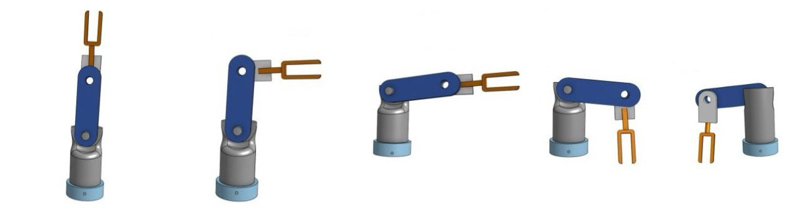

# 📐 3D CAD Project (Arm Design)

This is a 3D CAD project designed using [Onshape](https://www.onshape.com/) and exported file for public review.

## 📂 Files Included
- `3D_ARM.step` → The exported 3D CAD file
- `arm_pictures.png` → Preview image of the arm design

## 🌐 Live View on Onshape
You can view the 3D model directly via Onshape here: 
- (https://tinyurl.com/3D-onshape)

## 📄 Description
This model was created as part of a "smart method training" assignment. It demonstrates:
- Solid modeling using Onshape
- Clean export with preprocessing (`Remove small entities only - advanced`)
- Compatibility with most CAD software (e.g. SolidWorks, Fusion 360)

## 🎯 Purpose
- The project is shared here for educational purposes. It can be opened using any CAD software that supports STEP files.

## 📸 Design Preview

---
## 👤 Author
> Designed by: [Abdulrahman Qutah]  
> Date: [29 June 2025]

